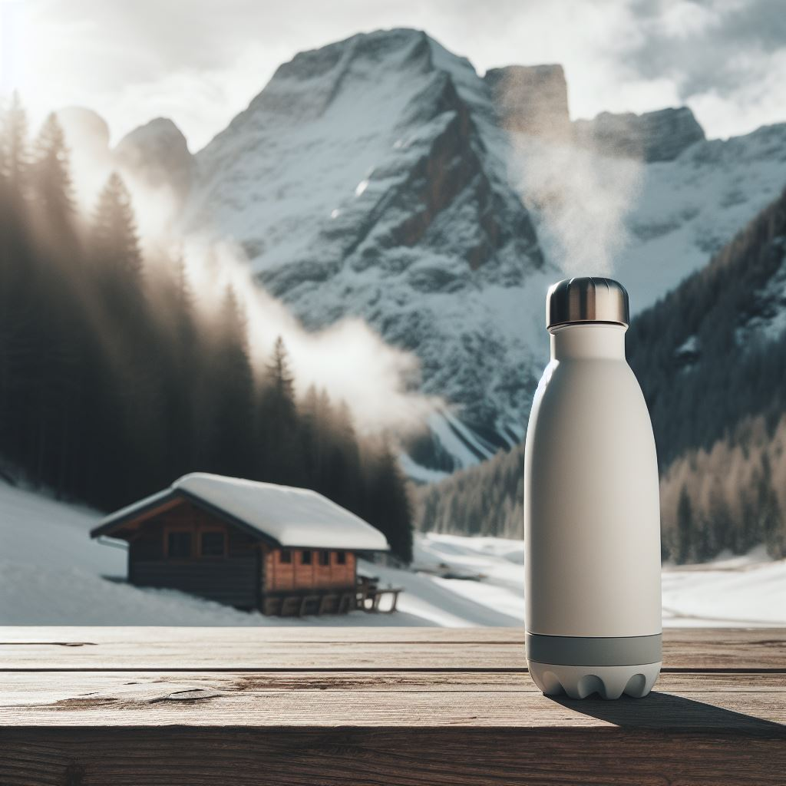
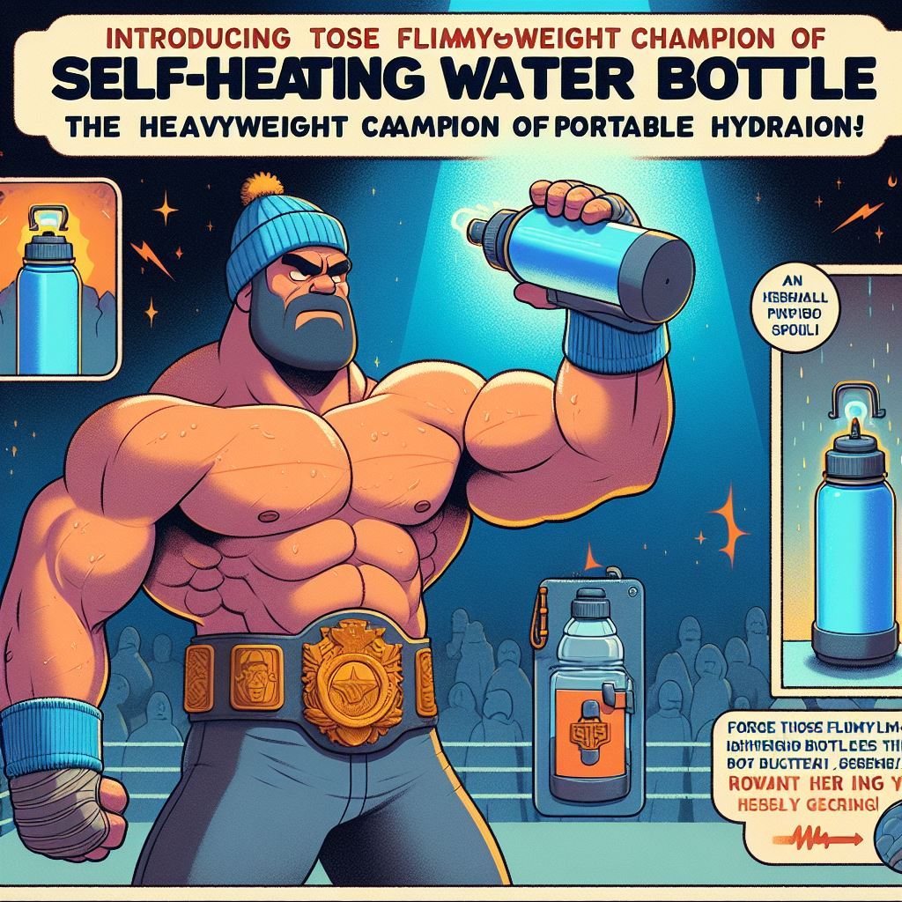
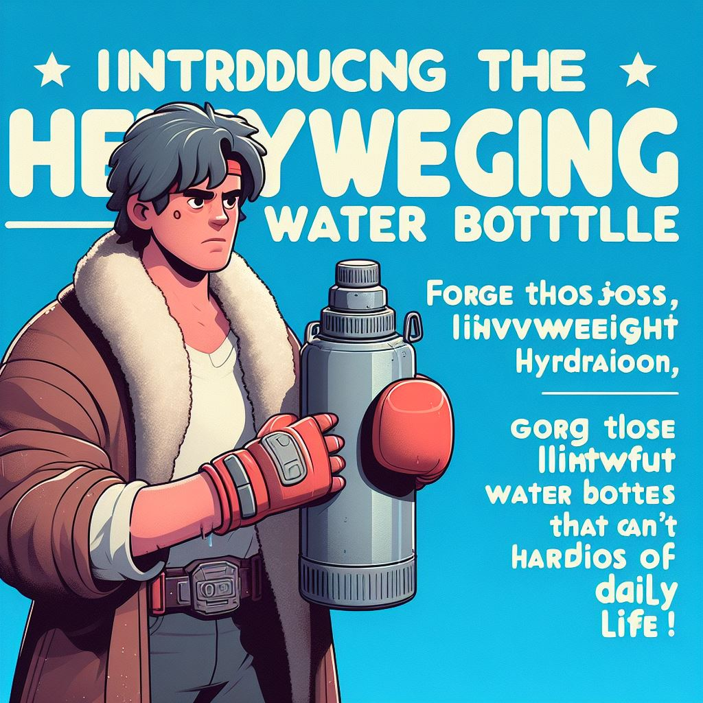
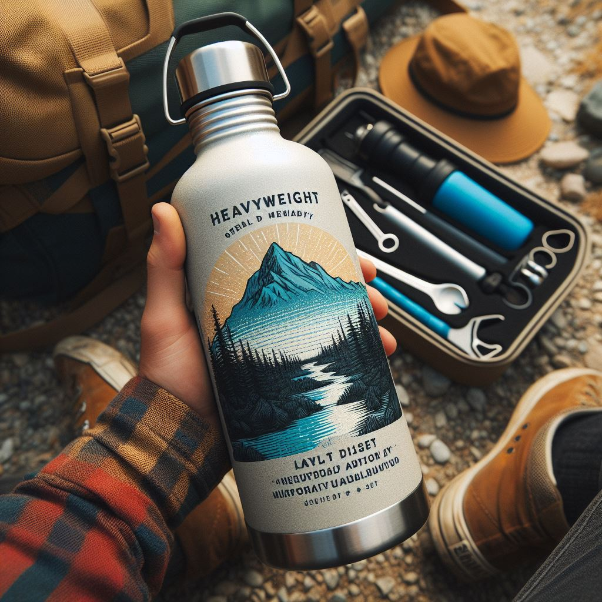

# Self-Heating Water Bottle

Embrace the warmth and reliability of the Self-Heating Water Bottle, the ultimate hydration companion for all your adventures. This sturdy, substantial water bottle is designed to keep your water warm for longer, ensuring you stay refreshed and revitalized no matter where your journeys take you.

**Features:**

- Heavyweight build for maximum durability and warmth retention
- Sturdy design that can handle daily wear and tear
- Innovative heating technology to keep your water warm for longer
- Distinctive, eye-catching appeal that sets it apart in the crowded water bottle market
- Substantial feel that adds to its solid, dependable construction

Never again worry about your water bottle failing you when you need it most. Our heavyweight design withstands whatever life throws at you, and the added weight adds to the bottle's solid, dependable feel in your hands. Whether you're hiking through the wilderness, camping in the great outdoors, or simply navigating your daily commute, the Self-Heating Water Bottle is your steadfast companion.

Quality and reliability are at the forefront of our design. Our sturdy construction guarantees durability, while our innovative heating technology keeps your water warm, providing a comforting and soothing hydration experience. The Self-Heating Water Bottle is the perfect choice for those who value quality, performance, and sustainability in their hydration solutions.

Enjoy the distinctive, eye-catching appeal of the Self-Heating Water Bottle, which sets itself apart in the crowded market of water bottles. Its standout features and solid, substantial feel make it a true conversation starter, showcasing your appreciation for superior design and quality.

Introducing the Self-Heating Water Bottle, the heavyweight champion of portable hydration! Forget those flimsy, lightweight water bottles that can't handle the rigors of daily life. Our Self-Heating Water Bottle is a substantial piece of equipment that's designed to withstand whatever you throw at it (not that we recommend actually throwing it). 

With a sturdy build that helps to maintain the warmth of your water for longer periods of time, our Self-Heating Water Bottle is perfect for those who demand durability and quality in their hydration solutions. You'll never have to worry about accidentally knocking it over or damaging it during your outdoor adventures. Plus, the added weight only adds to its substantial feel in your hands, making it a true standout in the crowded water bottle market.

    

Disclaimer: Images are generated using AI.
